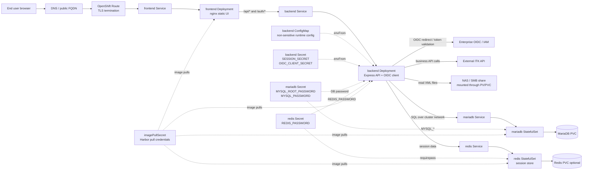
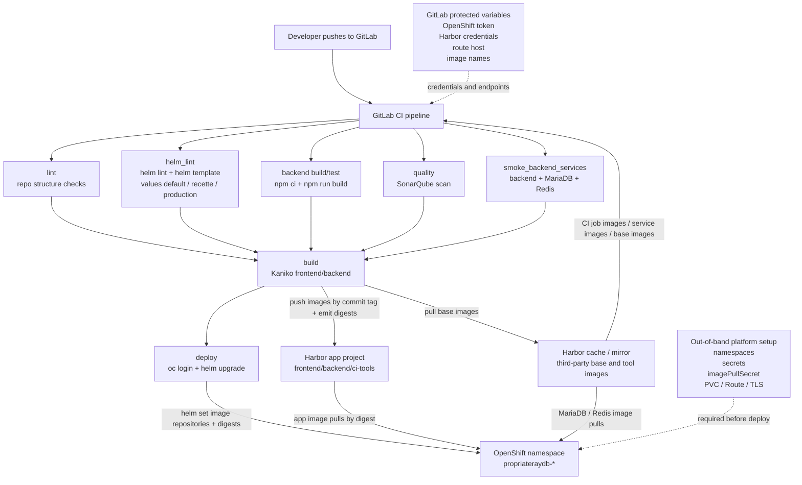

Best way: bring a **one-page deployment sketch + a requirements checklist** for the OpenShift team. For the meeting on **Thursday, April 30, 2026**, I’d frame it like this:

```text
GitLab CI
  |
  | pulls CI/tool/base images from Harbor cache
  | builds frontend/backend with Kaniko
  | pushes app images to Harbor app project
  v
Harbor
  - cache/mirror project: third-party images
  - app project: propriateraydb images
  |
  v
OpenShift namespace
  - pre-seeded app secrets
  - imagePullSecret
  - Helm deploys app resources
```

**What You Are Trying To Achieve**

Deploy `propriateraydb` through GitLab CI/CD into OpenShift using Helm, without storing passwords or registry credentials in Git. CI should build images, push them to Harbor, deploy by digest, and rely on OpenShift Secrets created out of band.

**Ask The OpenShift Team For**

1. **Namespaces / Projects**
   - Target namespace names, for example:
     - `propriateraydb-dev`
     - `propriateraydb-recette`
     - `propriateraydb-prod`
   - Confirm whether CI may create namespaces or whether they will be pre-created.
   - Recommendation: pre-create namespaces; do not give CI cluster-wide project creation rights.

2. **Deployment Service Account**
   - A service account/token for GitLab deploy per environment.
   - Permissions to run Helm inside the namespace:
     - `get/list/watch/create/update/patch/delete` on Deployments, StatefulSets, Services, ConfigMaps, Routes, ServiceAccounts, NetworkPolicies, PVCs.
     - Permission for Helm release metadata Secrets.
   - Clarify whether app Secrets are created by platform team, not by Helm.

3. **Secrets To Seed Out Of Band**
   Required app secrets:
   - `propriateraydb-backend-secrets`
     - `SESSION_SECRET`
     - `OIDC_CLIENT_SECRET`
   - `propriateraydb-mariadb-secrets`
     - `MYSQL_ROOT_PASSWORD`
     - `MYSQL_PASSWORD`
   - `propriateraydb-redis-secrets`
     - `REDIS_PASSWORD`

4. **Registry Access**
   - Harbor app project where CI pushes:
     - `frontend`
     - `backend`
     - `ci-tools`
   - Harbor cache/mirror project where CI/OpenShift pull third-party images:
     - Node
     - Nginx
     - MariaDB
     - Redis
     - Kaniko
     - Sonar scanner
     - UBI base image
   - Required pull secret in OpenShift, for example:
     - `harbor-pull`

5. **GitLab CI Variables**
   Ask who provides these:
   - `OPENSHIFT_SERVER`
   - `OPENSHIFT_NAMESPACE`
   - `OPENSHIFT_TOKEN`
   - `OPENSHIFT_ROUTE_HOST`
   - `HARBOR_REGISTRY`
   - `HARBOR_PROJECT`
   - `HARBOR_USERNAME`
   - `HARBOR_PASSWORD`
   - cache registry credentials if separate
   - optional `OPENSHIFT_CA_PEM`

6. **Networking / Route / TLS**
   - Public route hostname.
   - TLS termination policy.
   - Whether route cert is platform-managed, wildcard, or app-specific.
   - Egress access from backend to:
     - OIDC provider
     - ITK API
     - NAS / SMB mount if needed
     - MariaDB/Redis internal services

7. **Storage**
   - StorageClass for MariaDB PVC.
   - Size/quota.
   - Backup/restore expectations.
   - NAS PVC name if `backend.nas.enabled=true`.

## OpenShift Runtime Architecture And Data Flow



## GitLab CI/CD High-Level Flow



**Decision To Confirm**

Ask them clearly:

> “Do you want GitLab CI to only deploy Helm resources, while OpenShift/platform owns Secrets, image pull credentials, namespaces, storage, and route/TLS?”

